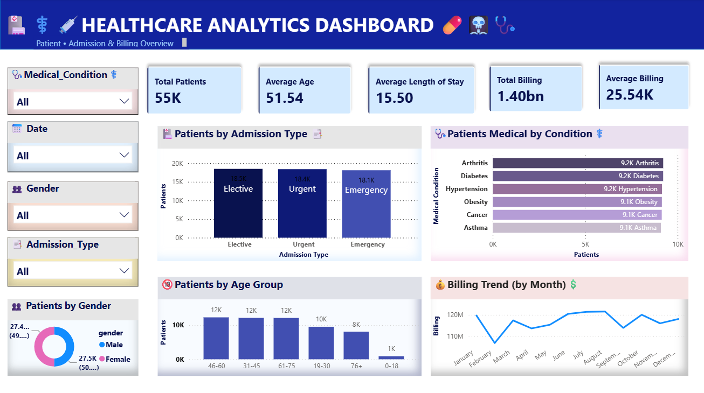

Healthcare Data Analytics


Project Overview


This is an end-to-end healthcare data analytics project using \*\*Python (Pandas), Excel, SQL, and Power BI\*\*.


The project analyzes hospital patient data to identify meaningful insights related to patients, admissions, medical conditions, age groups, gender, length of stay, and billing.


--Tools \& Technologies


Python

Pandas

Microsoft Excel

SQL

Power BI

DAX


--Project Workflow


```text

Raw Healthcare Dataset

&#x20;       ↓

Python (Pandas) - Data Cleaning \& Analysis

&#x20;       ↓

Excel Analysis

&#x20;       ↓

SQL Analysis

&#x20;       ↓

--Power BI Dashboard

```


Analysis Performed


--Python (Pandas)


Data loading

Data cleaning

Handling missing values

Exploratory Data Analysis

Data analysis using Pandas


--Excel Analysis


Data analysis

PivotTables

Patient analysis

Admission analysis

Gender analysis

Age-group analysis

Monthly billing analysis

Charts and visualizations


--SQL Analysis


Patient analysis

Admission analysis

Medical condition analysis

Gender analysis

Age analysis

Billing analysis

Length of stay analysis


--Power BI Dashboard


--The dashboard provides insights into:


Total Patients

Average Age

Average Length of Stay

Total Billing

Average Billing

Patients by Admission Type

Patients by Medical Condition

Patients by Age Group

Patients by Gender

Monthly Billing Trend

Interactive Filters


--Project Files


| File                       | Description                 |

| -------------------------- | --------------------------- |

| `healthcare\_dataset.csv`   | Original healthcare dataset |

| `healthcare\_cleaned.csv`   | Cleaned healthcare dataset  |

| `healthcare\_cleaned.xlsx`  | Excel analysis file         |

| `healthcare\_analysis.sql`  | SQL queries and analysis    |

| `healthcare\_Analysis.pbix` | Power BI dashboard          |

| `python/`                  | Python analysis files       |

|  `dashboard.png`           | Healthcare Analytics Dashboard |


--Dashboard Preview





--Project Objective


The objective of this project is to demonstrate an end-to-end data analytics workflow using multiple industry tools:


Python (Pandas) → Excel → SQL → Power BI


--Key Skills Demonstrated


Data Cleaning

Data Analysis

Exploratory Data Analysis

SQL Querying

Excel Data Analysis

Power BI Dashboard Development

DAX

Data Visualization

Business Insights


Author


Khushi Singh


\---


If you find this project useful, feel free to explore the analysis and dashboard.


